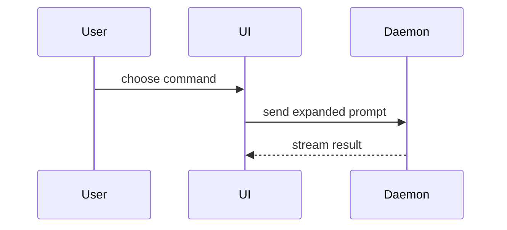

# Text views

Choose the shape that exposes the relevant relationship. Use actual names from the topic; the examples below illustrate presentation only.

## Logic and runtime flow

Use pseudocode for an algorithm:

```text
on(save)
  if content is unchanged
    return cached result
  write new content
  return fresh result
```

Use a call tree for runtime control flow:

```text
submitForm
  createSession
    persistPrompt
    launchAgent
  navigateToSession
```

## Structure and responsibility

Use a component tree, including state and module boundaries that matter:

```text
<SessionPage> (apps/example/src/routes/session.tsx)
  useSessionEvents()
  <SessionToolbar>
    <RunSkillButton> (packages/ui)
```

Use a shallow file tree for file responsibility or a broad refactor:

```text
src/
├── commands/       # parses user actions
├── sessions/       # owns session state
└── transport/      # sends API requests
```

## Interactions

Use Mermaid for component interaction, control flow, or data flow when the display supports it. Otherwise use a plain-text diagram.



## Changes

Use a diff when the surrounding shape already exists and the change is the point. The same approach works for component trees, file trees, calls, and state transitions:

```diff
 on(save)
-  write content
+  if content is unchanged
+    return cached result
+  write new content
+  invalidate cache
```

Show the whole block instead when most of it is new, omitted context would hide ownership or order, or the user needs a copyable target shape. Keep illustrative pseudocode distinct from executable code.
